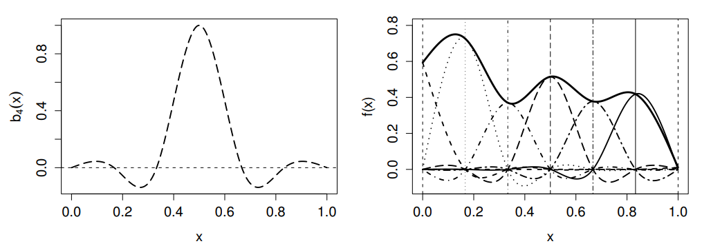

```{r include=FALSE}
knitr::opts_chunk$set(fig.path = 'figurasR/',
                      echo = FALSE, warning = FALSE, message = FALSE,
                      fig.pos="H",fig.align="center",out.width="95%",
                      cache=FALSE)

```


<!-- \setcounter{chapter}{2} -->
<!-- \setcounter{chapter}{2} escribir 2 para capítulo 3  -->
<!-- \pagenumbering{arabic} -->

\ifdefined\ifprincipal
\else
\setlength{\parindent}{1em}
\pagestyle{fancy}
\setcounter{tocdepth}{4}
\tableofcontents
<!-- \nocite{*} -->
\fi

\ifdefined\ifdoblecara
\fancyhead{}{}
\fancyhead[LE,RO]{\scriptsize\rightmark}
\fancyfoot[LO,RE]{\scriptsize\slshape \leftmark}
\fancyfoot[C]{}
\fancyfoot[LE,RO]{\footnotesize\thepage}
\else
\fancyhead{}{}
\fancyhead[RO]{\scriptsize\rightmark}
\fancyfoot[LO]{\scriptsize\slshape \leftmark}
\fancyfoot[C]{}
\fancyfoot[RO]{\footnotesize\thepage}
\fi
\renewcommand{\headrulewidth}{0.4pt}
\renewcommand{\footrulewidth}{0.4pt}


# Modelos aditivos generalizados

## Introducción

Como bien podemos intuir por su nombre, los modelos aditivos generalizados no son más que la fusión entre los modelos lineales generalizados y los modelos aditivos, los cuales se introducen con una sección en este capítulo. Podemos ver estos dos tipos de modelos como extensiones del modelo lineal. Por un lado, como vimos en el capítulo anterior, el MLG hace uso de una función de enlace entre el predictor lineal y el valor esperado de la variable dependiente para poder expresar relaciones más complejas y relaja la hipótesis distribucional permitiendo que tal variable siga distribuciones de la familia exponencial. Por otro lado, los modelos aditivos, además de también relajar esta hipótesis de distribución, introducen las funciones de suavizado en el modelo, estas proporcionan más flexibilidad a la hora de relacionar las variables explicativas con la de respuesta.

Luego, como ya hemos mencionado, y como se plantea en @Hastie, el MAG reune estas dos propuestas de modo que generaliza el modelo aditivo de la misma forma que el MLG generalizaba el modelo lineal. Sin embargo, la flexibilidad que proporciona este modelo da lugar a dos nuevos problemas teóricos: cómo estimar las funciones de suavizado y cómo de "suaves" deben ser. 

En este capítulo nos adentramos en los modelos no paramétricos, es decir, en aquellos que en vez de expresar la relación del valor esperado de la variable de respuesta con las variables predictoras mediante un predictor lineal, lo hacen mediante funciones $f$, como se vió en $\ref{eq:modelo general}$, pero ahora sin hacer ninguna suposición sobre ella. Esto conllevará en muchas ocasiones un mejor ajuste del modelo y traerá a la mesa una nueva cuestión conocida como sobreajuste que, aunque ya aparecía para los modelos paramétricos, ahora jugará un papel fundamental a la hora de querer predecir datos fuera de los observados. Este concepto refleja el hecho de que el modelo ajusta tan bien los datos proporcionados para la estimación de sus parámetros que es incapaz de mostrar la verdadera relación entre las variables que se estudian y, por tanto, da lugar a predicciones de nuevos datos que no serán las idóneas.

Tal y como se hace en @Wood, comenzaremos viendo cómo construir los modelos aditivos generalizados, es decir, qué bases de funciones podemos elegir para obtener las funciones de suavizado y qué parámetro de suavizado se debe seleccionar o cómo se puede estimar. Luego se introduce el modelo aditivo, en el que se utilizarán los resultados vistos a lo largo del capítulo. Tras todo ello se propone la forma final del modelo aditivo generalizado.


\begin{definición}[Estructura básica del modelo aditivo generalizado]
$$
\mu = \begin{pmatrix} \mu_1 \\ \vdots \\ \mu_n \end{pmatrix} = 
\begin{pmatrix} E[Y_1] \\ \vdots \\ E[Y_n] \end{pmatrix} = E[Y]
$$
\begin{equation}
g(\mu_i) = A_i\theta + f_1(x_{1i}) + f_2(x_{2i}) + f_3(x_{3i},x_{4i}) + \dots  \hspace{0.5cm}, 
\forall i =1,\dots,n
\label{eq:MAG}
\end{equation}
Donde:
\begin{itemize}
  \item $Y_i$ es la variable de respuesta y sigue una distribución de la familia exponencial de media $\mu_i$ y parámetro de escalado $\phi$. A partir de ahora esto lo denotaremos por: $Y_i \backsim EF(\mu_i,\phi)$.
  \item $A_i$ es la fila i-ésima de la matriz del modelo para aquellas componentes del modelo que son estrictamente paramétricas.
  \item $\theta$ es el correspondiente vector de parámetro, que antes denotábamos por $\beta$, para las variables predictoras mencionadas en el anterior punto.
  \item Las $f_i$ son las funciones de suavizado para las covariables $x_k$. Suelen ser desconocidas y el principal objetivo es el de estimarlas, pero también pueden darse casos, la mayoría de modelos biológicos, en los que son conocidas y nos interesa estimar otros parámetros del modelo.
\end{itemize}
\end{definición}


## Suavizado univariante

Dicho esto, partiremos considerando modelos que, aunque no sean adecuados para un uso práctico general, nos permitirán estudiar el marco teórico de una forma más sencilla. Es decir, en esta sección consideraremos un modelo con una sola función de suavizado, $f$, y una sola covariable, $x$, de la forma: 
\begin{equation}
y_i = f(x_i) + \epsilon_i
\label{eq: basic MAG}
\end{equation}
Donde $y_i$ es la variable de respuesta y los $\epsilon_i$ son variables aleatorias independientes e identicamente distribuidas como $N(0,\sigma^2)$ que representan el error.


### Bases de funciones

Nos proponemos en esta sección obtener una estimación de la función de suavizado a partir de una base de un espacio de funciones, en el que también se encontrará $f$ (o una aproximación suya). Elegir una base equivale a tomar un conjunto de funciones $\{b_j(x)\}_{j=1}^k$ y, por tanto, podemos representar la función de suavizado como:
\begin{equation}
f(x) = \sum_{j=1}^k b_j(x)\beta_j
\label{eq:base funcion suavizado}
\end{equation}
Para ciertos parámetros $\beta_j$ a determinar.

**Base polinómica** \newline
Si consideramos la base $\mathcal{B}$ del espacio de polinomios de grado k, es decir, $\mathcal{B} = \{1, x_i, x_i^2, \dots, x_i^k \}$, la función de suavizado toma la forma: 
$$
f(x) = \beta_1 + \beta_2 x + \beta_3 x^2 + \dots + \beta_{k+1} x^k
$$
Y, por tanto, el modelo $\ref{eq: basic MAG}$ queda:
$$
y_i = \beta_1 + \beta_2 x_i + \beta_3 x_i^2 + \dots + \beta_{k+1} x_i^k + \epsilon_i
$$

\begin{observación}[Problema de la base polinómica]
Notemos que por el teorema de Taylor, la base polinomial nos será útil cuando nuestro interés sea el de estudiar las propiedades de la función de suavizado en el entorno de un punto concreto, pero nos encontramos con problemas cuando queremos hacerlo en todo el dominio de $f$.

El principal problema se debe a que la interpolación de los datos puede resultar en una función muy oscilante o que no ajuste bien la información, dependiendo del valor de k, y que al modificar un coeficiente del modelo, el cambio impacta a los valores ajustados en todo el rango de la variable explicativa. Esto se puede solucionar de cierta manera con el siguiente tipo de base de funciones.
\end{observación}

**Base lineal por partes** \newline
Consideremos ahora una partición de nodos $\{x^*_j : j = 1,\dots,k \}$ del rango de la variable predictora $x$ tal que $x^*_j > x^*_{j+1}$ y la base de funciones $\mathcal{B} = \{b_j(x)\}_{j=1}^k$ donde:


$$
b_1(x) = \left\{
\begin{array}{ l }
\frac {x^*_2 - x} {x^*_2 - x^*_1} \hspace{0.5cm}, si \hspace{0.2cm} x < x^*_2  \\
0 \hspace{0.5cm} c.c.
\end{array}
\right. 
$$
$$
b_j(x) = \left\{
\begin{array}{ l }
\frac {x - x^*_{j-1}} {x^*_j - x^*_{j-1}} \hspace{0.5cm}, si \hspace{0.2cm} x^*_{j-1}<x < x^*_j  \\
\frac {x^*_{j+1} - x} {x^*_{j+1} - x^*_j} \hspace{0.5cm}, si \hspace{0.2cm} x^*_{j}<x < x^*_{j+1} \\
0 \hspace{0.5cm} c.c
\end{array}
\right.
$$

$$
b_k(x) = \left\{
\begin{array}{ l }
\frac {x - x^*_{k-1}} {x^*_k - x^*_{k-1}} \hspace{0.5cm}, si \hspace{0.2cm} x > x^*_{k-1}  \\
0 \hspace{0.5cm} c.c.
\end{array}
\right. 
$$
Es decir, la base de funciones $b_j(x)$ que son 0 en todo su dominio excepto entre los nodos a izquierda y derecha de $x_j^*$, donde crece y decrece de forma lineal hasta llegar a 1 en tal nodo. Este tipo de funciones se conocen como *tent functions*.

\begin{ejemplo}
Supongamos que el rango de $x$ va de 0 a 5 y consideremos 6 nodos: $\{0,1,2,3,4,5\}$, entonces podemos representar las funciones $b_0(x)$, $b_2(x)$ y $b_5(x)$ como:
```{r}
b0 <- function(x) {
  ifelse(x < 1, 1-x, 0)
}

b2 <- function(x) {
  ifelse(1< x & x < 2, x-1, ifelse(2<x & x<3,3-x,0))
}

b5 <- function(x){
  ifelse(x > 4, x-4, 0)
}

x <- seq(0, 5, length.out = 100)
y0 <- b0(x)
y2 <- b2(x)
y5 <- b5(x)

par(mfrow = c(1, 3))

plot(x, y0, type = "l", col = "blue", main = "Función básica b0(x)")
abline(v = 0, lty = 2, col = "green")
points(0, 0, col = "red", pch = 16)
text(0, 0, "x0", pos = 3)
plot(x, y2, type = "l", col = "blue", main = "Función básica b2(x)")
abline(v = 2, lty = 2, col = "green")
points(2, 0, col = "red", pch = 16)
text(2, 0, "x2", pos = 3)
plot(x, y5, type = "l", col = "blue", main = "Función básica b5(x)")
abline(v = 5, lty = 2, col = "green")
points(5, 0, col = "red", pch = 16)
text(5, 0, "x5", pos = 3)

```
\end{ejemplo}

De momento sólo planteamos estas formas de estimar las funciones de suavizado para tener una idea inicial y sencilla de cómo hacerlo pero más adelante dedicamos una sección a mejorar estas estimaciones mediante *splines*.

### Control del suavizado

Nos interesará ahora controlar el grado de suavizado del GAM. Para ello tendremos en cuenta que el modelo aproxime de forma correcta los datos a la vez que la curvatura se mantiene controlada. Consideramos un nuevo parámetro $\lambda$, denominado parámetro de suavizado, el cuál tiene como principal función el compensar entre la fidelidad a los datos del modelos y el grado de suavizado del mismo.

Notemos primero que podemos representar la penalización a la curvatura de $f$ como: 
$$
\int(f'')^2
$$
Y en el caso de utilizar la base de funciones lineales por partes se puede aproximar[^2] por:
$$
\sum_{j=2}^{k-1}(f(x_{j-1}^*)-2f(x_j^*)+f(x_{j+1}^*))^2
$$

Es fácil observar que cuando $f$ es una línea recta la penalización es 0 y cuando presenta muchas fluctuaciones en su curvatura este término es mayor.

[^2]: Se supone que se los nodos están espaciados de manera uniforme, pues en el caso de no que lo estuvieran habría que añadir pesos a la suma.

Luego, en vez de ajustar el modelo por mínimos cuadrados, ahora se hará añadiendo la anterior penalización, es decir, minimizando: 
\begin{equation}
||y - X\beta||^2 + \lambda \sum_{j=2}^{k-1}(f(x_{j-1}^*)-2f(x_j^*)+f(x_{j+1}^*))^2
\label{pen-least-squares}
\end{equation}

\begin{observación}
Mientras mayor sea $\lambda$ más importancia le estaremos dando a que la función $f$ sea suave y menos a que a aproxime bien los datos. De hecho, cuando $\lambda \rightarrow \infty $ la función de suavizado $f$ que minimiza la anterior expresión será una línea recta y cuando $\lambda=0$ resultará en una estimación no penalizada. 
\label{param-suav}
\end{observación}

### Elección del parámetro de suavizado

Cómo hemos visto en la observación anterior: si el parámetro de suavizado es muy grande, el modelo será demasiado simple como para ajustarse bien a los datos y si es muy pequeño, la función de suavizado tendrá una curvatura muy alta. En cualquiera de los casos se tendrá que la estimación de $f$ no se parecerá a la función real que ajusta los datos. Por ello, debemos dar un criterio para la elección de $\lambda$.

Un primer criterio planteado en @Wood es el de elegir $\lambda$ de forma que minimice la siguiente expresión para $x_1,\dots,x_n$ unas observaciones dadas.
$$
M = \frac{1}{n} \sum_{i=1}^n(\hat{f_i}-f_i)^2
$$
Donde $\hat{f_i} = \hat{f}(x_i)$ es la evaluación de los puntos dados en la estimación de la función y $f_i = f(x_i)$ son sus evaluaciones en la función real.

Sin embargo, como la función $f$ es desconocida, no es posible utilizar este criterio directamente. Daremos entonces una primera versión **método de validación cruzada**.

\begin{definición}[Validación cruzada ordinaria]
Sea $\hat{f_i}^{[-i]}$ la estimación de la función de suavizado que ajustada por todos los datos $\{(x_j,y_j)\}_{j=1}^n$ menos el i-ésimo, se define la validación cruzada ordinaria como:
\begin{equation}
\nu_0 = \frac{1}{n} \sum_{i=1}^n(\hat{f_i}^{[-i]}-y_i)^2
\label{cross-val-ord}
\end{equation}

\end{definición}

Se puede entender como que se ajusta el modelo sin utilizar la observación $(x_i,y_i)$, se predice la variable de respuesta con este modelo en el punto $x_i$ y luego se calcula la diferencia al cuadrado entre la estimación y el valor observado $\forall i=1,\dots ,n$.

\begin{observación}
Podemos ver que tomar $\lambda$ de modo que minimice $\nu_0$ es una buena manera de abordar que minimice M. Para ello veamos que $E[\nu_0] \approx E[M] + \sigma^2$. Sustituyendo en $\ref{cross-val-ord}$ que $y_i = f_i + \epsilon_i$ nos queda que:
$$
\nu_0 = \frac{1}{n} \sum_{i=1}^n(\hat{f_i}^{[-i]}-f_i + \epsilon_i)^2 = 
        \frac{1}{n} \sum_{i=1}^n[(\hat{f_i}^{[-i]}-f_i)2 - 2(\hat{f_i}^{[-i]}-f_i)\epsilon_i + \epsilon_i^2]
$$
Entonces, tomando valor esperado y teniendo en cuenta que $E[\epsilon_i]=0$ y que $\epsilon_i$ y $f_i$ son independientes:
$$
E[\nu_0] = \frac{1}{n} E[\sum_{i=1}^n(\hat{f_i}^{[-i]}-f_i)^2] + \sigma^2 = E[M] + \sigma^2
$$
Por lo tanto, cuando $n \rightarrow \infty$ se tienen las igualdades $E[\nu_0] = E[M] + \sigma^2$ y $\hat{f}^{[-i]} = \hat{f}$.
\end{observación}

Si los modelos sólo fueran juzgados por su capacidad de ajustar los datos que les aportamos, entonces siempre se elegirían los modelos más complejos, pero el elegir el modelo que maximice la capacidad de predecir nuevos datos no tiene este problema.

Sin embargo, como se indica en @Wood, p.171, este método es costoso computacionalmente, ya que se deben realizar n ajustes de los datos, por ello se propone un nuevo método el cuál hace uso de la matriz de influencia $A$.

\begin{definición}[Validación cruzada generalizada]
Dadas unas observaciones $\{(x_i,y_i)\}_{i=1}^n$ se elige $\lambda$ tal que minimice:
$$
\nu_g = n \frac{\sum_{i=1}^n(y_i-\hat{f_i})^2}{(n-tr(A))^2}
$$
\end{definición}

## Modelos aditivos

Como ya hemos mencionado previamente, el modelo aditivo es una extensión del modelo de regresión lineal. Su principal característica, la cual da lugar a su nombre, es que los efectos de las variables predictoras sobre la variable de respuesta son aditivos, es decir, una vez ajustado el modelo aditivo se pueden examinar tales efectors por separado. Veremos primero la forma general del modelo aditivo tal y como la introduce @Hastie y luego desarrollaremos la teoría alrededor de él para el caso de dos variables predictoras.

\begin{definición}[Modelo aditivo]
Supongamos el contexto de las anteriores de las definiciones de modelos, el modelo aditivo se expresa como:
$$
Y = \alpha + \sum_{j=1}^p f_j(X_j) + \epsilon
$$
Donde $\alpha$ es el término independiente, $\epsilon$ son errores aleatorios independientes de los $X_j$ tales que $E[\epsilon] = 0$ y $Var(\epsilon)= \sigma^2$, y las $f_j$ son funciones que conviene suponer univariadas y suaves pero no es necesario.
\end{definición}

\begin{observación}
Además se debe tener que $E[f_j(X_j)]=0 \hspace{0.5cm} \forall j =1,\dots,n$, pues de otro modo las funciones $f_j$ añadirían términos independientes constantes adicionales.
\end{observación}

Suele ser útil el pensar el modelo aditivo como un método que primero estima los parámetros adecuados en los que medir las variables y luego realiza el análisis lineal estándar sobre las variables transformadas. La principal motivación a priori tras este tipo de modelos es que, al representar por separado el efecto de cada variable predictora, mantienen la interpretabilidad del modelo lineal.

En lo que sigue, para poder ajustar más fácilmente el modelo como en @Wood, supondremos que se tienen sólo dos variables predictoras $X = (X_1,\dots,X_p)$ y $V = (V_1,\dots,V_p)$ y consideraremos el modelo aditivo:
\begin{equation}
y_i = \alpha + f_1(x_i) + f_2(v_i) + \epsilon_i
\label{modelo aditivo}
\end{equation}

\begin{observación}
Los principales problemas del modelo aditivo son:
\begin{itemize}
  \item La suposición de los efectos aditivos sobre $\ref{eq:modelo general}$ es bastante restrictiva.
  \item Existen problemas de identificabilidad pues las $f_j$ son estimables con una precisión de una constante aditiva.
\end{itemize}
Sin embargo, si suponemos resueltos estos problemas, el modelo aditivo puede ser representado por splines de regresión penalizados, los cuales serán estimados mediante mínimos cuadrados penalizados, y el grado de suavizado, que se obtendrá por validación cruzada.
\end{observación}

**Modelo aditivo por regresión penalizada por partes**

En lo que sigue, consideraremos la base del espacio de funciones lineales por partes vista en la sección anterior, es decir, expresamos las funciones $f_1$ y $f_2$ como:
$$
f_1(x) = \sum_{j=1}^{k_1} b_j(x)\delta_j \\
f_2(v) = \sum_{j=1}^{k_2} \beta_j(v)\gamma_j
$$
Donde $\delta_j$ y $\gamma_j$ son parámetros conocidos y las $b_j$ y $\beta_j$ son las funciones básicas de tipo carpa para los nodos $x^*_j$ y $v^*_j$ respectivamente, los cuales están espaciados uniformemente en el rango de $x$ y $v$. 

Definimos ahora los vectores n-dimesionales $\vec{f_1} = (f_1(x_1),\dots,f_1(x_n))^T$ y $\vec{f_2} = (f_2(v_1),\dots,f_2(v_n))^T$ como:
$$
\vec{f_1} = X_1\delta = 
\begin{pmatrix}
b_1(x_1) & \dots & b_{k1}(x_1) \\ \vdots & \dots & \vdots \\ b_1(x_n) & \dots & b_{k1}(x_n)
\end{pmatrix}
\begin{pmatrix} 
\delta_1 \\ \vdots \\ \delta_{k1}
\end{pmatrix} = 
\begin{pmatrix}
\sum_{j=1}^{k1} b_j(x_1)\delta_j \\ \vdots \\ \sum_{j=1}^{k1} b_j(x_n)\delta_j
\end{pmatrix} = 
\begin{pmatrix}
f_1(x_1) \\ \vdots \\ f_1(x_n)
\end{pmatrix}
$$
$$
\vec{f_2} = X_2\gamma = 
\begin{pmatrix}
\beta_1(v_1) & \dots & \beta_{k2}(v_1) \\ \vdots & \dots & \vdots \\ \beta_1(v_n) & \dots & \beta_{k2}(v_n)
\end{pmatrix}
\begin{pmatrix} 
\gamma_1 \\ \vdots \\ \gamma_{k1}
\end{pmatrix} = 
\begin{pmatrix}
\sum_{j=1}^{k2} \beta_j(v_1)\gamma_j \\ \vdots \\ \sum_{j=1}^{k2} \beta_j(v_n)\gamma_j
\end{pmatrix} = 
\begin{pmatrix}
f_2(v_1) \\ \vdots \\ f_2(v_n)
\end{pmatrix}
$$

\begin{proposición}
En el caso de considerar la base lineal por partes, los coeficientes $\beta_j$ que definen a una función $f$ coinciden con los valores de la función en los nodos, es decir, $\beta_j = f(x^*_j)$.
\end{proposición}

Gracias a esto, se tiene que el problema de ajuste de la regresión penalizada se reduce a minimizar la siguiente expresión respecto de $beta$: 
$$
||y-X\beta||^2 + \lambda\beta^TS\beta
$$
Donde $S = D^TD$ con $D = \begin{pmatrix} 1 & -2 & 1 & 0 & \dots & \dots \\ 0 & 1 & -2 & 1 & 0 & \dots \\ 0 & 0 & 1 & -2 & 1 &  \dots \\  \dots & \dots & \dots & \dots & \dots & \ddots\end{pmatrix}$.

Por lo tanto, la penalización asociada a las funciones $f_1$ y $f_2$ vienen dadas por:
$$
\left\{
\begin{array}{ l }
\delta^TD_1^TD_1\delta = \delta S_1\delta \\
\gamma^TD_2^TD_2\gamma = \gamma S_2 \gamma
\end{array}
\right.
$$

Además, para tratar el problema de identificabilidad utilizaremos la siguiente restricción lineal:
$$
\left\{
\begin{array}{ l }
\sum_{i=1}^nf_1(x_i) = 0 \Leftrightarrow \bar{1}^T \vec{f_1} = 0 \Leftrightarrow \bar{1}^TX\delta = 0 \hspace{0.3cm} \forall \delta \Leftrightarrow \bar{1}^TX = 0 \\ 
\sum_{i=1}^nf_2(v_i) = 0 \Leftrightarrow \bar{1}^T \vec{f_2} = 0 \Leftrightarrow \bar{1}^TV\gamma = 0 \hspace{0.3cm} \forall \gamma \Leftrightarrow \bar{1}^TV = 0
\end{array}
\right.
$$
Donde $\bar{1}$ es un vector n-dimensional con todas las componentes iguales a 1. Ahora bien, para que se pueda cumplir esta condición debemos retirar de cada columna de las marices X y V la media de tales columnas, es decir, definiremos las nuevas matrices centradas por columnas y las respectivas transformaciones de $f_1$ y $f_2$: 
$$
\left\{
\begin{array}{ l }
\tilde{X} = X - \bar{1} \bar{1}^T \frac{X}{n} \hspace{0.3cm},\hspace{0.3cm}\tilde{f_1} = \tilde{X}\delta \\ 
\tilde{V} = V - \bar{1} \bar{1}^T \frac{V}{n} \hspace{0.3cm},\hspace{0.3cm}\tilde{f_2} = \tilde{V}\gamma
\end{array}
\right.
$$
\begin{observación}
Esta nueva restricción y la transformación de las funciones no afecta a las restricciones impuestas con anterioridad, de hecho solo implica un cambio constante en las funciones: 
$$
\tilde{f_1} = \tilde{X} \delta = X\delta - \bar{1} \bar{1} X \frac{\delta}{n} = X\delta  - \bar{1}c = f_1 - c
$$
Para la constante $c=\bar{1}X\frac{\delta}{n}$.Se hace de forma análoga para $f_2$.
\end{observación}
Finalmente, notemos que el proceso de centrado por columnas reduce el rango a $k_1-1$, así que sólo se podrán estimar $k_1-1$ de los $k_1$ elementos de $\delta$ de forma única. Para solucionar este problema se retira una columna de $\tilde{X}$ y de $D_1$ y la correspondiente componente de $\delta$ se hace 0.

Gracias a este razonamiento, el modelo aditivo puede ser expresado como $Y = Z\beta + \epsilon$, 
donde $Z = (\bar{1},X,V)$ y $\beta = (\alpha,\delta,\gamma)^T$. De este modo, la penalización que añadimos al criterio de mínimos cuadrados es:
$$
\beta^T S_1 \beta = (\alpha,\delta^T,\gamma^T)
\begin{pmatrix}
0 & 0 & 0 \\ 0 & S_1 & 0 \\ 0 & 0 & 0
\end{pmatrix}
\begin{pmatrix} \alpha \\ \delta \\ \gamma \end{pmatrix} = 
\delta^T S_1 \delta
$$

**Ajuste del modelo aditivo por mínimos cuadrados penalizados**
Gracias a la expresión de la penalización que acabamos de obtener para el modelo aditivo $\ref{modelo aditivo}$ se tiene que la estimación de los coeficientes $\hat{\beta}$ del modelo se obtienen minimizando la función objetivo de mínimos cuadrados penalizados:
\begin{equation}
||y- X\beta||^2 + \lambda_1 \beta^T S_1 \beta + \lambda_2 \beta^T S_2 \beta
\label{min-cuad-pen}
\end{equation}

Donde $\lambda_1$ es el parámetro de suavizado que controla a $f_1$ y $\lambda_2$ el que controla a $f_2$. Entonces, los estimadores de $\beta$ son:
$$
\hat{\beta} = (X^TX + \lambda_1 S_1 \lambda_2 S_2)^{-1} X^TY
$$

## Smoothers

En esta sección razonaremos de forma similar a la sección [3.2.1][Bases de funciones], es decir, queremos definir una base de funciones $\mathcal{B} = \{b_i(x)\}_{i=1}^k$ de forma que las funciones de suavizado se puedan expresar como una combinación lineal de estas funciones básicas. La base lineal por partes, vista en la sección antes mencionada, ofrece una forma razonable de representar las funciones de suavizado para los modelos aditivos, pero nos proponemos ahora dar mejores bases de funciones que tengan el mismo objetivo. Para ello, utilizaremos bases de splines ya que, para un tamaño de base fijado, reducen significativamente el error de aproximación de las funciones de suavizado.

### Splines cúbicos

Será de interés el dedicarle una sección al marco teórico tras los splines, pues están muy relacionados con la mayoría de suavizadores. Como en @Wood, no abordaremos el tema de forma general, sino que se pueden recoger las ideas principales mediante las propiedades de los splines cúbicos. Veremos esto primero en el contexto de la interpolación y luego en el del suavizado.

\begin{definición}[Spline cúbico]
Dada una colección de puntos $\mathcal{C} = \{(x_i,y_i) / i = 1,\dots, n\}$ tales que $x_i \leq x_{i+1}$, decimos que $s:[x_1,x_n] \rightarrow \mathbb{R}$ es un spline cúbico si verifica: 
\begin{itemize}
  \item $s|_{[x_j,x_{j+1}]} = s_j$, donde $s_j$ es un polinomio de grado 3 en $[x_j,x_{j+1}]$.
  \item $s(x_j) = y_j \hspace{0.3cm} \forall j = 1,\dots,n$.
  \item $s$ es continua hasta la segunda deriva en los nodos $x_j$, es decir, se cumple que: 
  $$
  s_{j+1}(x_{j+1})=s_{j}(x_{j+1}) ,\hspace{0.3cm}   
  s'_{j+1}(x_{j+1})=s'_{j}(x_{j+1}) ,\hspace{0.3cm}
  s''_{j+1}(x_{j+1})=s''_{j}(x_{j+1}) \hspace{0.2cm} \forall j = 1,\dots,n
  $$
\end{itemize}
\end{definición}

Se dice que un spline cúbico es natural cuando: $s''(x_1) = 0 = s''(x_n)$

**Splines cúbicos naturales como interpoladores** \newline

Partimos considerando una colección de puntos $\mathcal{C} = \{(x_i,y_i) / i = 1,\dots, n\}$ tales que $x_i \leq x_{i+1}$ y el spline cúbico natural $s(x)$ que interpola los puntos de $\mathcal{C}$. Entonces, en @Wood se propone la siguiente proposición como uno de los resultados más importantes en la teoría de splines: 

\begin{proposición}
De entre todas las funciones $f$ continuas en $[x_1,x_n]$, con primera derivada absolutamente continua y que interpolan los puntos de $\mathcal{C}$, $s(x)$ es la más suave de todas ellas en el sentido que minimiza: 
$$
J(f) = \int_{x_1}^{x_n} f''(x)^2 dx
$$
\label{prop-interp}
\end{proposición}

\begin{proof}
Sea $f(x)$ una función que verifique las condiciones del enunciado y sea distinta de $s(x)$, definimos $h(x) = f(x) - s(x)$ y busquemos una expresión de $J(f)$ en función de $J(s)$:
$$
J(f) = \int_{x_1}^{x_n} f''(x)^2 dx = \int_{x_1}^{x_n} (s''(x) + h''(x))^2 dx = 
\int_{x_1}^{x_n} s''(x)^2dx + 2\int_{x_1}^{x_n} s''(x)h''(x)dx + \int_{x_1}^{x_n}h''(x)^2dx
$$
Ahora bien, aplicando integración por partes en el término del medio de la última igualdad queda:
\begin{equation*}
\begin{split}
\int_{x_1}^{x_n} s''(x)h''(x)dx = s''(x_n)h'(x_n) - s''(x_1)h'(x_1) - \int_{x_1}^{x_n} s'''(x)h'(x)dx = \\
- \int_{x_1}^{x_n} s'''(x)h'(x)dx = - \sum_{i=1}^{n-1} s'''(x_i^+)\int_{x_i}^{x_{i+1}} h''(x)dx = 
- \sum_{i=1}^{n-1} s'''(x_i^+)(h(x_{i+1}) - h(x_i)) = 0
\end{split}
\end{equation*}

Hemos utilizado que $s''(x_1) = 0 = s''(x_n)$ y que como $s$ es un spline cúbico, $s'''$ es constante en cada intervalo $(x_i,x_{i+1})$, $x_i^+$ denota cualquier elemento de tal intervalo. Luego, nos queda que: 
$$
\int_{x_1}^{x_n} f''(x)^2 dx = \int_{x_1}^{x_n} s''(x)^2 +  \int_{x_1}^{x_n} h''(x)^2 dx \geq \int_{x_1}^{x_n} s''(x)^2
$$
De hecho, la igualdad sólo se tiene cuando $h''(x)=0 \hspace{0.2cm} \forall x \in (x_1,x_n)$. Sin embargo, como $h(x_1) = 0 = h(x_n)$ pues $f$ y $s$ tienen los mismos valores en los nodos, podemos observar que se da la igualdad si y sólo si $h(x)=0 \hspace{0.2cm} \forall x \in [x_1,x_n]$. Es decir, cualquier otra función de interpolación distinta de $s$ tendrá mayor valor de la integral del cuadrado de su segunda derivada.
\end{proof}

Esta proposición nos indica una razón de por qué el spline cúbico es el interpolador más suave para cualquier conjunto de datos. Sin embargo, esta no es la única propiedad interesante para tener en cuenta a los splines cúbicos a la hora de querer estimar las funciones de suavizado, como indica @Wood, en de Boor(1978, Capítulo 5), se enumeran una serie de resultados que indican que sea cual sea la verdadera función que representa los datos, un spline debe ser capaz de aproximarla de manera eficaz y además, si quisieramos construir un modelo a partir de funciones de suavizado de las covariables, el aproximar estas funciones por las aproximaciones más suaves puede ser una idea llamativa. 

**Splines cúbicos de suavizado**  \newline

En los estudios estadísticos los datos con los que trabajamos suelen ser medidos con ruido, así que por lo general será más útil el suavizar los datos que el interpolarlos. Con tal propósito, nos será más conveniente el tratar a $s(x_i)$ como $n$ parámetros de un spline cúbico, los cuáles pueden ser estimados minimizando: 
$$
\sum_{i=1}^n (y_i-s(x_i))^2 + \lambda \int s''(x)^2dx
$$
Donde $\lambda$ es el parámetro ajustable de suavizado. La función $s$ resultante se conoce como Spline cúbico de suavizado y, de hecho, verifica:

\begin{proposición}
El spline cúbico de suavizado $s(x)$ minimiza: 
\begin{equation}
\sum_{i=1}^n (y_i-f(x_i))^2 + \lambda \int f''(x)^2dx
\label{min-spline-suavizado}
\end{equation}
para toda función $f$ continua en $[x_1,x_n]$, con derivada absolutamente continua. 
\label{spline-suav}
\end{proposición}

La prueba de este resultado se basa en la propiedad de los interpoladores $\ref{prop-interp}$.

\begin{proposición}
Se obtiene el mismo resultado de $\ref{spline-suav}$ si en vez de utilizar la suma de los cuadrados de los residuos en $\ref{min-spline-suavizado}$ utilizamos la log-verosimilitud.
\end{proposición}

Debido a estos resultados, los splines cúbicos parecen los suavizadores ideales pero tienen un problema computacional importante, ya que se deberán estimar tantos parámetros como datos queramos suavizar.

\begin{observación}[Splines de regresión penalizada]
Una buena forma de balancear las propiedades que ofrecen los splines con la eficiencia computacional será el utilizar mínimos cuadrados penalizados $\ref{min-cuad-pen}$. En su forma más simple, esto conlleva formar una base de splines junto con sus respectivas penalizaciones para un conjunto de datos de cardinal menor al conjunto original y luego utilizarlos para modelar el conjunto completo.

Con este método nos surge la duda de cuántos elementos debe tener la base de splines. Generalmente esto no es posible saberlo sin conocer la función real que queremos estimar, pero es posible observar cómo debe escalar la dimensión de la base cuando se aumenta el número de datos. Se ve de manera detallada en @Wood (Capítulo 5.2, p.199).
\end{observación}


### Smoothers unidimensionales

Nos disponemos ahora a estudiar algunas bases penalizadas de suavizadores de las que se desarrollan en @Wood en el caso de tener una sola variable predictora.

**Splines cúbicos de regresión** \newline

Acabamos de ver varias propiedades interesantes de los splines cúbicos como suavizadores, veamos ahora como construirlo a partir de unos datos dados. Existen muchas bases equivalentes para representar splines cúbicos, nosotoros lo abordaremos como en @Wood, parametrizando el spline en términos de su valor en los nodos. 

Partimos considerando un spline cúbico $f(x)$ y k nodos $\{x_1,\dots,x_k\}$ con $x_i \leq x_{i+1}$.Denotaremos entonces $\beta_j = f(x_j)$ y $\delta_j = f''(x_j)$, pues de esta forma el spline $f$ puede escribirse como:
$$
f(x) = a_j^-(x) \beta_j + a_j^+(x) \beta_{j+1} + c_j^-(x) \delta_j + c_j^+(x)\delta_{j+1} \hspace{0.3cm} ,\forall x \in [x_j,x_{j+1}]
$$
Sea $h_j = x_{j+1}-x_j$, las funciones básicas $a_j^-$, $a_j^+$, $c_j^-$ y $c_j^+$ vienen dadas por: 
\begin{equation*}
\begin{split}
a_j^-(x) = \frac{x_{j+1} - x}{h_j} \hspace{0.6cm}
c_j^-(x) =  \frac{1}{6} [\frac{(x_{j+1} - x)^3}{h_j} - h_j(x_{j+1}-x)] \\
a_j^+(x) =  \frac{x - x_j}{h_j} \hspace{1.7cm}
c_j^+(x) = \frac{1}{6} [\frac{(x - x_j)^3}{h_j} - h_j(x-x_j)]
\end{split}
\end{equation*}

Ahora bien, para representar formalmente las condiciones que debe cumplir el spline: continuidad hasta la segunda derivada en los nodos $x_j$ y que en los nodos extremos, $x_1$ y $x_k$, la segunda derivada sea nula, se utiliza: 
$$
B\delta^- = D \beta
$$
donde $\delta^- = (\delta_2,\dots,\delta_{k-1})^T$, $\delta_1 = 0 = \delta_k$ y B y D son definidas como: 
$$
\left\{
\begin{array}{ l }
B_{i,i} = \frac{h_i+h_{i+1}}{3}  \\
B_{i,i+1} = \frac{h_{i+1}}{6} \\
B_{i+1,i} = \frac{h_{i+1}}{6}
\end{array}
\right. \hspace{0.2cm} \forall i = 1,\dots,k-3
\hspace{0.5cm}
\left\{
\begin{array}{ l }
D_{i,i} = \frac{1}{h_i}  \\
D_{i,i+1} = -\frac{1}{h_{i}} -\frac{1}{h_{i+1}} \\
D_{i,i+2} = \frac{1}{h_{i+1}}
\end{array}
\right. \hspace{0.2cm} \forall i = 1,\dots,k-2
$$

Luego, definiendo $F^- = B^{-1}D$ y $F = \begin{pmatrix}  \bar{0} \\ F^- \\ \bar{0} \end{pmatrix}$, donde $\bar{0}$ es una fila de ceros, tenemos que $\delta = F \beta$ y de esta forma el spline se puede reescribir como: 
$$
f(x) = a_j^-(x) \beta_j + a_j^+(x) \beta_{j+1} + c_j^-(x) F_j\beta + c_j^+(x) F_j\beta \hspace{0.3cm} ,\forall x \in [x_j,x_{j+1}]
$$
Y renombrando las funciones básicas de cierta forma nos queda finalmente que: 
$$
f(x) = \sum_{i=1}^k b_i(x) \beta_i
$$
\begin{observación}
Gracias a esta nueva forma de expresar el spline mediante las funciones básicas podemos expresar la penalización de curvatura de la siguiente forma: 
$$
\int_{x_1}^{x_k}f''(x)^2dx = \beta^T D^T B^{-1}D \beta = \beta^T S \beta
$$
Donde $S = D^TB^{-1}D$ se conoce como la matriz de penalizado asociada a tal base.
\label{S}
\end{observación}

Además de proporcionar parámetros directamente interpretables, la base de splines cúbicos no requiere de ningún re-escalado de las covariables, sólo de la elección de los nodos $x_j$.

```{r, echo = FALSE,out.width='80%',fig.cap = "\\label{figura01} Ejemplos de función básica y spline cúbico",fig.align='center'}

```

Figura \ref{figura01}: A la izquierda se ve representada la funcion básica $b_4(x)$ para los splines cúbicos de regresión que se desarrollan en esta sección, esta toma el valor 1 en el nodo 0.5 y 0 en los demás. La cuadrícula de la derecha muestra cómo las funciones básicas se combinan para representar una curva de suavizado. Con menor grosor y con formatos de linea distintos se pueden distinguir las funciones básicas y de forma más llamativa se ve la suma escalada de ellas por los coeficientes $\beta_j$. (@Wood, p.203).

**B-Splines**  \newline

Veámos ahora otra base para el espacio de funciones de splines de grado p con nodos $x_1 < x_2 < \dots < x_{k+1}$ arbitrarios. La principal ventaja de la base de B-Splines es que las funciones básicas se definen de forma local, lo que ofrecerá ventajas computacionales frente a las demás bases.

Para definir la base de B-Splines de forma recursiva como en @CursoMNP, denotaremos $M = p+1$ y consideraremos $2M$ nodos auxiliares $\tau_i$ de forma arbitraria de forma que: 
$$
\tau_1 \leq \tau_2 \leq \dots \leq \tau_M \leq x_0 \hspace{0.2cm} , \hspace{0.2cm}
x_{k+1} \leq \tau_{k+M+1} \leq \dots \leq \tau_{k+2M}
$$
Observemos que los nuevos nodos al escogerse arbitrariamente se podrían tomar como: 
$$
\tau_1 = \dots = \tau_M = x_0 \hspace{0.2cm} , \hspace{0.2cm}
x_{k+1} = \tau_{k+M+1} = \dots = \tau_{k+2M}
$$
Reescribiremos la nueva particion como: $\tau_{j+M} = x_j \hspace{0.2cm} \forall j = 1,\dots,k$. 
Luego, se define la base de B-Splines de forma recursiva como: 
$$
B_j^{-1}(x) = \left\{
\begin{array}{ l }
1, \hspace{0.2cm} si \hspace{0.2cm} x_j \leq x < x_{j+1} \\ 
0, \hspace{0.1cm} en \hspace{0.1cm} caso \hspace{0.1cm} contrario
\end{array}
\right. \hspace{0.3cm} \forall j = 1,\dots,k+2M-1
$$

$$
B_j^m(x) = \frac{x - \tau_j}{\tau_{j+m-1} - \tau_j}B_j^{m-1}(x) + 
           \frac{\tau_{j+m} - x}{\tau_{j+m} - \tau_{j+1}}B_{j+1}^{m-1}(x) 
, \hspace{0.3cm} \forall j = 1,\dots,k+2M-m
$$
\begin{observación}
Estas bases fueron desarrolladas como bases muy estables para la interpolación de splines a gran escala, sin embargo la mayoría de trabajos estadísticos con splines de regresión penalizados de rango menor (es decir, con métodos de suavizado que imponen una reduccion de rango en la matriz asociada al suavizado) deben utilizar métodos numéricos muy deficientes antes de que esta estabilidad sea perceptible. El verdadero interés de la estadística en los B-Splines surge en el desarrollo de los P-Splines.
\end{observación}

**P-Splines** \newline

Los P-Splines se definen como suavizadores que utilizan bases de B-Splines para una partición uniforme de nodos a los que se les aplica una penalización de suavizado para los parámetros $\beta_i$. Una forma sencilla de definirlos es utilizando la penalización de la diferencia al cuadrado de los parámetros $\beta_j$ adyacentes, es decir, dados los nodos $x_1<\dots<x_k$ se considera la penalización: 
$$
\mathcal{P} = \sum_{i=1}^{k-1}(\beta_{i+1}-\beta_i)^2 = \beta^T P^TP\beta
$$
Donde:
$$
P = \begin{pmatrix} -1 & 1 & 0 & \dotsb & \dotsb \\
                    0 & -1 & 1 & 0 & \dotsb \\
                     \dotsb & \dotsb &  \dotsb & \dotsb & \ddots
     \end{pmatrix},
\hspace{0.3cm} 
P\beta = \begin{pmatrix} \beta_2 - \beta_1 \\ \vdots \\ \beta_k - \beta_{k-1}
\end{pmatrix}
$$
Luego: 
$$
\mathcal{P} = \beta \begin{pmatrix} -1 & 1 & 0 & \dotsb & \dotsb & \dotsb\\
                    -1 & 2 & -1 & 0 & \dotsb & \dotsb\\
                    0 & -1 & 2 & -1 & 0 & \dotsb \\
                     \dotsb & \dotsb &  \dotsb & \dotsb & \dotsb & \ddots
\end{pmatrix} \beta
$$
\begin{observación}
Los P-Splines son fáciles de aplicar y ofrecen una buena flexibilidad a la hora de combinar cualquier orden de penalización con cualquier tamaño de base de los B-Splines. Sin embargo, si se utiliza una partición no uniforme de los nodos, su simplicidad disminuye.  
\end{observación}

Otra penalización que podemos utilizar es sobre las derivadas de los splines definidos en $[a,b]$. Sean $m_1$ el orden de la base de B-Splines y $m_2$ el orden de diferenciación requerido para la penalización:
$$
J = \int_a^b f^{m_2}(x)^2 dx = \beta^T S \beta 
$$
como en \ref{S}. Se debe entonces buscar $S$, para ello consideraremos una partición ordenada de nodos: $a = x_1 < \dots < x_{k-m_1+1}=b$ de modo que $h_j = x_{j+1}-x_j \hspace{0.2cm} \forall j =1,\dots,k-m$ que definirá la base de B-Splines y razonamos de la siguiente forma: 

  1. Para cada intervalo $[x_j,x_{j+1}]$ generar $p+1$ puntos igualmente espaciados tal que para $p=0$ se elige el punto central del intervalo y para $p \geq 1$ se deben elegir los extremos $x_j$ y $x_{j+1}$. Denotaremos el conjunto ordenado de estos puntos por $\mathcal{C}$.
  2. Obtener la matriz $G$ aplicando los coeficientes del spline a la $m_2$-ésima derivada del spline $f$ en los puntos de $\mathcal{C}$.
  3. Si $p=0$, entonces $W = diag(h_j)$. 
  4. Si $p>0$, entonces consideremos $P,H \in \mathcal{M}^{(p+1) \times (p+1)}$ con elementos: 
  $P_{i,j} = (\frac{-1+2(i-1)}{p})^j$ y $H_{i,j} = \frac{1+(-1)^{i+j-2}}{i+j-1}$ $\forall i,j = 1,\dots,p+1$ y calculemos $\tilde{W} = P^{(-T)}HP^{-1}$. Además, tomar $W = \sum_q W^q$, donde $W^q$ es 0 en todos lados excepto en $W^q_{i+pq-p,j+pq-p}= \frac{h_q}{2}\tilde{W}_{i,j} \hspace{0.2cm} \forall i,j=1,\dots,p+1$. W es una matriz banda con $2p+1$ diagonales no nulas.
  5. La matriz banda de coeficientes de penalización es: $S = G^TWG$.
  

## Modelos aditivos generalizados

Cómo ya hemos mencionado varias veces a lo largo del trabajo y como se indica en @Wood, en los MAG se quiere predecir algunas funcionasmonótonas que expresan la relación entre los predictores y el valor esperado de la variable de respuesta. Del mismo modo que para los MLG la variable de respuesta debe seguir una distribución de tipo exponencial, $\ref{Dist-exponencial}$.

Mientras que el modelo aditivo se estimaba mediante mínimos cuadrados penalizados, el MAG se estirmará utilizando máxima verosimilitud penalizada, aunque en la práctica se utiliza un algoritmo de iteración de mínimos cuadrados penalizados (PIRLS). Partimos dando la definión general del modelo como lo hace @Wood:

\begin{definición}[Estructura general del modelo aditivo generalizado]
Sean:
\begin{itemize}
  \item $Y$ un vector aleatorio n-dimensional, cuyas componentes siguen una distribución de tipo exponencial $y_i \backsim EF(\mu_i,\phi)  \hspace{0.2cm} \forall i=1,\dots,n$.
  \item $X$ una matriz de orden $n \times p$, $p \leq n$, de columnas $x_j \hspace{0.2cm} \forall j=1,\dots,p$ con constantes conocidas.
  \item $f_j: \mathbb{R} \rightarrow \mathbb{R} \hspace{0.2cm} \forall j = 1, \dots,p$ funciones desconocidas.
  \item $A$ la matriz asociada al modelo paramétrico de orden $n \times p$.
  \item $\gamma$ un vector de parámetros de dimensión n.
  \item $g: \mathbb{R} \rightarrow \mathbb{R}$ una función monótona y diferenciable.
\end{itemize}
Definimos el Modelo Aditivo Generalizado como:
\begin{equation}
g(\mu_i) = A_i \gamma + \sum_{j=1}^p f_j(x_{ij})
\label{MAG}
\end{equation}
\end{definición}

@Wood también propone una definición alternativa utilizando distintas formas de $L_{ij}$:
$$
g(\mu_i) = A_i \gamma + \sum_{j=1}^p L_{ij}f_j(x_{ij})
$$
La más básica de ella es: $L_{ij}f_j(x_j) = f_j(x_{ij})$ que da la forma habitual del MAG, pero existen otras variaciones de ellas y cada una tiene una utilidad específica.

Luego, para cada $f_j$ se deben elegir una base de suavizado y una penalización, las cuales dan lugar a las matrices modelo $X^{[j]}$ y a la matriz de penalización $S^{[j]}$, de modo que $X_{ik}^{[j]} = b_{jk}(x_{ji})$ para $b_{jk}$ la k-ésima función básica para $f_j$. En lo que sigue, combinaremos la matriz $A$ con las $X^{[j]}$ por columnas para crear a la matriz del modelo completo: 
$$
\mathcal{X} = (A \hspace{0.1cm}|\hspace{0.1cm}X^{[1]} \hspace{0.1cm}|\hspace{0.1cm}X^{[2]}\hspace{0.1cm}| \dotsb )
$$

### Ajuste del modelo

Seguiremos las directrices dadas en @Wood para dar la estimación de los parámetros $\beta$ cuando suponemos dado los parámetros de suavizado $\lambda$. Partimos notando que el vector de parámetros $\beta$ contiene a $\gamma$ y a los vectores de parámetros de suavizado individuales y observemos que una penalización del grado de suavizado global para el modelo viene dada por: 
$$
\sum_j \lambda_j \beta^T S_j \beta
$$
Donde $\lambda_j$ es un parámetro de suavizado y $S_j$ es por abuso de notación la anterior $S_j$ incrustada como un bloque diagonal en una matriz para que $\lambda_j \beta^T S_j \beta$ sea la penalización para $f_j$.

Observemos que de este modo el modelo se reduce a un MLG sobreparametrizado de la forma:
$$
g(\mu_i) = \mathcal{X}_i \beta, \hspace{0.2cm} y_i \backsim EF(\mu_i,\theta_i)
$$
El cual se estima maximizando la log-verosimilitud penalizada: 
\begin{equation}
l_p(\beta) = l(\beta) - \frac{1}{2\phi} \sum_j \lambda_j \beta^T S_j \beta
\label{obj-pen}
\end{equation}

\begin{observación}
Aquí, como en \ref{param-suav}, los parámetros de suavizado controlan la compensación entre la calidad de ajuste del modelo y su grado de suavizado.
\end{observación}

Ahora, en @Wood se hace notar que esta función objetivo coincide con la de un Modelo Linear Generalizado Mixto (MLGM)[^3] y se propone estimarlo por la siguiente variación del \ref{IRLS}.

[^3]: No nos adentramos en los MLGM por falta de tiempo pero tampoco hace falta su desarrollo para la comprensión del algoritmo.

\begin{definición}[Algoritmo de mínimos cuadrados penalizados reponderados iterativamente] 

  1. Inicialización: tomar $\hat{\mu_i} = y_i + \delta_i$ y $\hat{\eta_i} = g(\hat{\mu_i})$, donde $\delta_i$ suele ser 0 ó una constante que asegure que  $\hat{\eta_i}$ sea finito. \newline
  2. Calcular: $z_i = g'(\mu_i) \frac{y_i-\hat{\mu_i}}{\alpha(\mu_i)} + \hat{\eta_i}$ y $\omega_i = \frac {\alpha(\hat{\mu}_i)}{g'(\hat{\mu}_i)^2V(\hat{\mu}_i)}$ \newline
  3. Encontrar $\hat{\beta}$ el parámetro que minimiza la función objetivo de mínimos cuadrados ponderados penalizados $\ref{obj-pen}$: 
$$
||z-\mathcal{X} \beta||^2_W + \sum_j \lambda_j \beta^T S_j \beta
$$
  y actualizar $\hat{\eta} = \mathcal{X} \hat{\beta}$ y $\hat{\mu_i} = g^{-1}(\hat{\eta}_i)$

\label{PIRLS}
\end{definición}

Donde $||a||^2_W = a^TWa$, $V(\mu)$ es la función de varianza asociada a la distribución de la familia exponencial y $\alpha(\mu_i) = [1+(y_i-\mu_i)(\frac{V'(\mu_i)}{V(\mu_i)} + \frac{g''(\mu_i)}{g'(\mu_i)})]$.


