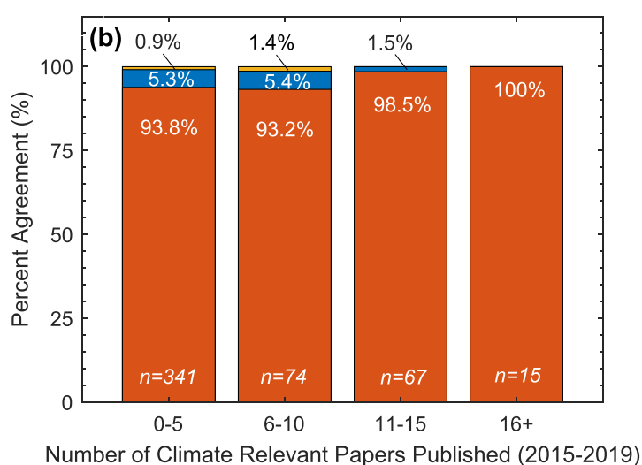
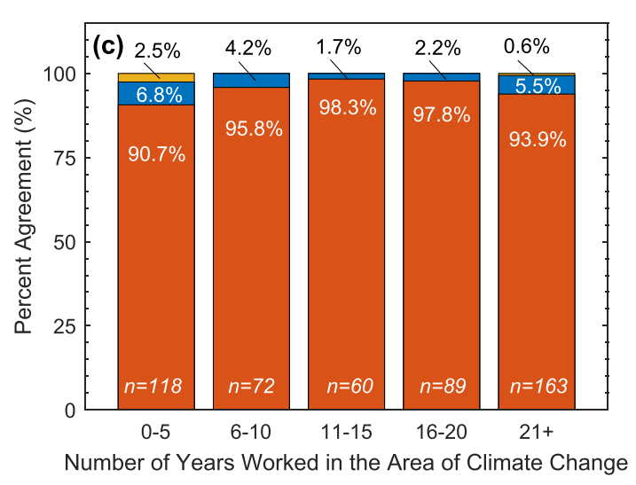

```{r include=FALSE}
knitr::opts_chunk$set(fig.path = 'figurasR/',
                      echo = FALSE, warning = FALSE, message = FALSE,
                      fig.pos="H",fig.align="center",out.width="95%",
                      cache=FALSE)

```


<!-- \setcounter{chapter}{2} -->
<!-- \setcounter{chapter}{2} escribir 2 para capítulo 3  -->
<!-- \pagenumbering{arabic} -->

\ifdefined\ifprincipal
\else
\setlength{\parindent}{1em}
\pagestyle{fancy}
\setcounter{tocdepth}{4}
\tableofcontents
<!-- \nocite{*} -->
\fi

\ifdefined\ifdoblecara
\fancyhead{}{}
\fancyhead[LE,RO]{\scriptsize\rightmark}
\fancyfoot[LO,RE]{\scriptsize\slshape \leftmark}
\fancyfoot[C]{}
\fancyfoot[LE,RO]{\footnotesize\thepage}
\else
\fancyhead{}{}
\fancyhead[RO]{\scriptsize\rightmark}
\fancyfoot[LO]{\scriptsize\slshape \leftmark}
\fancyfoot[C]{}
\fancyfoot[RO]{\footnotesize\thepage}
\fi
\renewcommand{\headrulewidth}{0.4pt}
\renewcommand{\footrulewidth}{0.4pt}


# Cambio climático


En la convención de 1992 de las Naciones Unidas sobre el cambio climático se recoge la defición de cambio climático como: " _El cambio de clima atribuido directa o indirectamente a la actividad humana que altera la composición de la atmósfera mundial y que se suma a la variabilidad natural del clima observada durante periodos de tiempo comparables._ "

Ahora bien, para una correcta comprensión de esta definición es necesario dar una noción de clima, ya que existe una confusión generalizada entre los conceptos de clima y tiempo. Por un lado, con tiempo atmosférico nos referimos al estado de la atmósfera en un momento y lugar preciso, este depende de una serie de variables climáticas como la presión, la temperatura, las precipitaciones, etc. Por otro lado, el clima se entiende como las condiciones meteorológicas dadas en un mismo lugar durante un periodo largo de tiempo.

## Consenso científico

Desde la convención de Río de Janeiro antes mencionada se tiene un consenso internacional sobre la existencia del cambio climático, sin embargo todavía no se ha llegado a tal consenso respecto al efecto que ha tenido la humanidad en el cambio climático, es decir, respecto al Calentamiento Global Antropogénico (CGA). Lo más cercano a ello es el consenso científico.

Para tratar este tema nos referiremos al artículo @consenso de la editorial IOPScience del 2021, el cual hace una sintésis de distintos estudios sobre el consenso entre expertos sobre el cambio climático y realiza su propio estudio comparándolo con uno de más de 10 años atrás. Este estudio se basa en una encuesta dirigida a la comunidadde ciencias de la Tierra, en el artículo se desarrolla su metodología y se desglosan todos los resultados diferenciando entre distintas características de los encuestados (área en la que están especializados, número de publicaciones científicas, número de publicaciones relevantes...), pero nosotros nos centraremos en su conclusión.

Lo primero que se destaca de la investigación es que, en comparación a otra del 2009, el número de científicos que no aceptan el impacto humano en el cambio climático se ha reducido a más de la mitad, pasa del 20% a tan solo el 9%, es decir, ahora alrededor de un 91% de los encuestados están de acuerdo con la acción que tiene el hombre el calentamiento global. Además, si distinguimos los grados de experiencia de los encuestados por el número de publicaciones relevantes sobre el cambio climático en los últimos años, resulta que aquellos con más de 15 publicaciones relevantes aceptan el efecto humano en un 100% y aquellos con más de 10 en un 98.5% (1 profesional de entre los 67 que abarca el grupo). 

También es interesante destacar el siguiente par de conclusiones que saca el artículo: el área de los expertos encuestados con un menor porcentaje de acuerdo con el calentamiento global antropogénico es el de la geología económica (7% menos que el la media) y aquellos profesionales con más años de experiencia (sin depender del número de publicaciones científicas) en el sector también tienden a tener una menor aceptación. Podemos observar los resultados de forma más detallada en las siguientes gráficas.

```{r, echo = FALSE,out.width='50%',fig.cap = "\\label{figura02} Porcentaje de aceptación respecto del número de publicaciones relevantes en los últimos años.",fig.align='center'}

```
```{r, echo = FALSE,out.width='60%',fig.cap = "\\label{figura03} Porcentaje de aceptación respecto de los años trabajados en el ámbito del cambio climático. ",fig.align='center'}

```

## Controversia 
