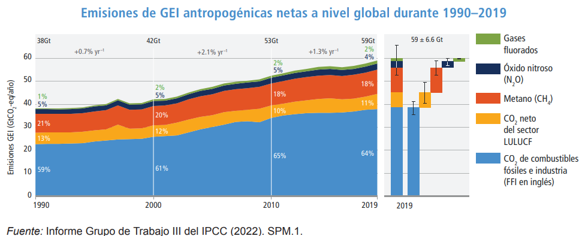

```{r include=FALSE}
knitr::opts_chunk$set(fig.path = 'figurasR/',
                      echo = FALSE, warning = FALSE, message = FALSE,
                      fig.pos="H",fig.align="center",out.width="95%",
                      cache=FALSE)

```


<!-- \setcounter{chapter}{2} -->
<!-- \setcounter{chapter}{2} escribir 2 para capítulo 3  -->
<!-- \pagenumbering{arabic} -->

\ifdefined\ifprincipal
\else
\setlength{\parindent}{1em}
\pagestyle{fancy}
\setcounter{tocdepth}{4}
\tableofcontents
<!-- \nocite{*} -->
\fi

\ifdefined\ifdoblecara
\fancyhead{}{}
\fancyhead[LE,RO]{\scriptsize\rightmark}
\fancyfoot[LO,RE]{\scriptsize\slshape \leftmark}
\fancyfoot[C]{}
\fancyfoot[LE,RO]{\footnotesize\thepage}
\else
\fancyhead{}{}
\fancyhead[RO]{\scriptsize\rightmark}
\fancyfoot[LO]{\scriptsize\slshape \leftmark}
\fancyfoot[C]{}
\fancyfoot[RO]{\footnotesize\thepage}
\fi
\renewcommand{\headrulewidth}{0.4pt}
\renewcommand{\footrulewidth}{0.4pt}


# Cambio climático


En la convención de 1992 de las Naciones Unidas sobre el cambio climático se recoge la defición de cambio climático como: " _El cambio de clima atribuido directa o indirectamente a la actividad humana que altera la composición de la atmósfera mundial y que se suma a la variabilidad natural del clima observada durante periodos de tiempo comparables._ "

Ahora bien, para una correcta comprensión de esta definición es necesario dar una noción de clima, ya que existe una confusión generalizada entre los conceptos de clima y tiempo. Por un lado, con tiempo atmosférico nos referimos al estado de la atmósfera en un momento y lugar preciso, este depende de una serie de variables climáticas como la presión, la temperatura, las precipitaciones, etc. Por otro lado, el clima se entiende como las condiciones meteorológicas dadas en un mismo lugar durante un periodo largo de tiempo.

## Consenso científico

Desde la convención de Río de Janeiro antes mencionada se tiene un consenso internacional sobre la existencia del cambio climático, sin embargo todavía no se ha llegado a tal consenso respecto al efecto que ha tenido la humanidad en él, es decir, respecto al Calentamiento Global Antropogénico (CGA). Lo más cercano a ello es el consenso científico.

Para tratar este tema nos referiremos al artículo @consenso de la editorial IOPScience, el cual hace una sintésis de distintas investigaciones sobre el consenso entre expertos sobre el cambio climático y realiza su propio estudio comparándolo con uno de más de 10 años atrás. Este estudio se basa en una encuesta dirigida a la comunidad de ciencias de la Tierra, en el artículo se desarrolla su metodología y se desglosan todos los resultados diferenciando entre distintas características de los encuestados (área en la que están especializados, número de publicaciones científicas, número de publicaciones relevantes...), pero nosotros nos centraremos únicamente en sus conclusiones.

Lo primero que se destaca de la investigación es que, en comparación a otra del 2009, el número de científicos que no aceptan el impacto humano en el cambio climático se ha reducido a más de la mitad, pasa del 20% a tan solo el 9%, es decir, ahora alrededor de un 91% de los encuestados están de acuerdo con la acción que tiene el hombre en el calentamiento global. Además, si distinguimos los grados de experiencia de los encuestados por el número de publicaciones relevantes sobre el cambio climático en los últimos años, resulta que aquellos con más de 15 publicaciones relevantes aceptan el efecto humano en un 100% y aquellos con más de 10 en un 98.5% (1 profesional de entre los 67 que abarca el grupo). 

También es interesante destacar el siguiente par de conclusiones que saca el artículo: el área de los expertos encuestados con un menor porcentaje de acuerdo con el calentamiento global antropogénico es el de la geología económica (7% menos que la media) y aquellos profesionales con más años de experiencia (sin depender del número de publicaciones científicas) en el campo también tienden a tener una menor aceptación. Podemos observar los resultados de forma más detallada en las siguientes gráficas.

```{r, echo = FALSE,out.width='50%',fig.cap = "\\label{figura02} Porcentaje de aceptación respecto del número de publicaciones relevantes en los últimos años.",fig.align='center'}
knitr::include_graphics("figurasR/figura02.png")
```
```{r, echo = FALSE,out.width='60%',fig.cap = "\\label{figura03} Porcentaje de aceptación respecto de los años trabajados en el ámbito del cambio climático. ",fig.align='center'}

```
El 2.5% que aparece en el segundo diagrama se corresponde con aquellos que no solo niegan el CGA sino que niegan por completo la existencia del cambio climático.

## Controversia 

Sin embargo, aunque exista un consenso internacional sobre la existencia del cambio climático y uno científico sobre el efecto que tiene la humanidad en él, aún hay personas y organizaciones que lo niegan. Este hecho conlleva a que las instituciones implicadas en la lucha del cambio climático se vean envueltas en una crisis de la desinformación, además de la crisis medioambiental que se proponen combatir. Estos contenidos negacionistas no solo socavan el apoyo público mediante información y anuncios dudosos, sino que también erosionan la confianza en estas instituciones. 

Varios estudios de ciencias sociales han analizado estas posturas como formas de negacionismo, pseudociencia e incluso propaganda. La coalición de la Acción Contra la Desinformación Climática (CAAD sus siglas en inglés) realizó el informe @CAAD , resumido en el artículo de @desinfo de EuroNews, en el que se puede intuir quiénes están detrás de estas fuentes de desinformación y el por qué de sus intereses en ellas. En este artículo se recoge que, ahora más que nunca, es importante que las sociedades tengan una visión compartida sobre el cambio climático que se base en datos y en la integridad de la información. Sin embargo, la desinformación es una piedra en el camino para este objetivo, pues además de poner al cambio climático en el punto de mira de teorías conspirativas y de ser una causa para la división social, perjudica la implementación y el debate de nuevas políticas climáticas.

En el informe antes mencionado se detallan tres casos en los que la desinformación y los bulos son perjuciales para la lucha del cambio climático:

\begin{itemize}
  \item Por un lado, nombra una serie de páginas webs y editoriales que publican desinformación sobre el clima y se lucran a través de bolsas de anuncios. Esto significa que muchas marcas posicionadas en contra de, por ejemplo, la emisión de gases contaminantes aparezcan junto a estos artículos y de forma indirecta permitan su monetización.
  \item Por otro lado, expone un caso asociado a los medios de comunicación estatales rusos. El CAAD afirma que estos medios utilizan campañas de desinformación con mensajes incoherentes y falsos para reforzar planes de influencia contra países Occidentales y del sur Global.
  \item Por último habla sobre las grandes compañías petroleras, las cuales invierten millones de dólares en publicidad con el objetivo de lavar la imagen de su marca. Tienen presupuestos inmensos destinados al desarrollo de anuncios en los que suelen alardear de sus inversiones en energías renovables, pero el análisis del CAAD muestra que estas empresas sólo aportaron el 1% de la inversión mundial en energías limpias.
\end{itemize}

No obstante, estos ejemplos no son más que la punta del iceberg de una gran crisis de la información, ya que existen muchas más entidades e individuos que sacan provecho de una cuestión tan importante como esta y a la par que perjudican a los organismos que pretenden combatirla.

Citemos a continuación una serie de argumentos utilizados por los negacionistas: 
\begin{itemize}
  \item Sólo se tienen datos desde el 1960, el clima comenzó a calentarse antes de la revolución industrial.
  \item El dióxido de carbono se quedará en la atmósfera durante décadas o siglos.
  \item Se han producido otros cambios climáticos a lo largo de la historia.
  \item Se achacan catástrofes al calentamiento global aunque no hay pruebas para vincularlas.
  \item Si hay una ola de frío, ¿Cómo va a haber calentamiento global? (Dicho por Donald Trump en 2018).
  \item El cambio climático tiene efectos positivos como obtener mejores cosechas de cereales en los países que son menos cálidos.
  \item No hay calentamiento global desde 1998.
  \item No están aumentando los fenómenos meteorológicos extremos.
\end{itemize}

## Resumen del cambio climático en la actualidad {#ResumenCC}

Nos basaremos en el sexto informe del Grupo Intergubernamental de Expertos sobre Cambio Climático (más conocido por sus siglas en inglés, IPCC). El IPCC es una entidad científica creada en 1988 por la Organización Meteorológica Mundial y el Programa de Naciones Unidas para el Medio Ambiente y tiene como principal propósito el proporcionar información objetiva, clara, equilibrada y neutral del estado actual de conocimientos sobre el cambio climático. Lo haremos refiriéndonos a los resúmenes en español realizados por la Oficina Española de Cambio Climático, los cuales se pueden encontrar en su web @OficinaCC.

El cambio climático constituye un fenómeno global, tanto por sus causas como por sus efectos, y
requiere una respuesta multilateral basada en la colaboración de todos los países, ya no solo a nivel internacional, sino también a nivel regional.

El primer grupo de trabajo abre el apartado sobre la situación actual del cambio climático con la siguiente aserción: " _Es indiscutible que las actividades humanas están causando un cambio climático, haciento que los eventos extremos sean más frecuentes y severos_". Tras ello, exponen las siguientes observaciones: 

\begin{itemize}
  \item La concentración de $CO_2$ en la atmósfera es la más alta en los últimos 2 millones de años.
  \item El incremento de la subida del mar en el último siglo es mayor que al registrado en cualquier
siglo anterior en los últimos 3000 años.
  \item La superficie de hielo marino ártico está en su nivel más bajo en los últimos 1000 años.
  \item La temperatura media en la última década (2011-2020) fue aproximadamente 1.09°C superior a la temperatura media entre 1850 y 1900.
\end{itemize}

Lo siguiente que nos interesa notar está desarrollado por el grupo III de trabajo del IPCC, el cual se encarga del informe de mitigación. Hacen una evaluación actual de las tendencias de las emisiones antropogénicas de gases contaminantes a nivel global y por sectores. Por un lado, afirman que las emisiones de gases de efecto invernadero (GEI) han seguido aumentando a nivel global entre 2010 y 2019. Aunque en la siguiente gráfica podemos observar que, en comparación a la década anterior, se ha reducido el aumento por año de las emisiones netas en un 0.8%, el total aumenta ya hasta las 59Gt (Gigatoneladas). [^4] [^5]

```{r, echo = FALSE,out.width='110%',fig.cap = "\\label{figura04}Emisión de GEI desde 1990 hasta 2019",fig.align='center'}

```

[^4]: LULUCF son las siglas en inglés de "uso de la tierra, cambio de uso de la tierra y selvicultura".
[^5]: Gt$CO_2$-eq es una medida en toneladas de la huella de carbono,es decir, de la totalidad de la emisión de gases de efecto invernadero.

Además de ello, comparan las emisiones netas acumuladas de $CO_2$ entre 2010 y 2019 con las que se pueden emitir a partir de 2020 para limitar el calentamiento global a 1.5°C y a 2°C, estas representarían $\frac{4}{5}$ de las emisiones para la primera y aproximadamente $\frac{1}{3}$ para la segunda. La Unión Europea comenta en @consecuencias cuáles pueden ser algunas de las consecuencias de este incremento de temperaturas: 
\begin{itemize}
  \item Aumento de la mortalidad.
  \item Reducción de la productividad.
  \item Cambios en la distribución geográfica de las zonas climáticas que alteren el ecosistema de especies vegetales y animales.
  \item Influencia en la fenología, el comportamiento y los ciclos de vida de las especies. Esto puede hacer que aumente el número de plagas y de especies invasoras, así como la incidencia de algunas enfermedades humanas.
  \item Aumento de la evaporación del agua, lo que, unido a la falta de precipitaciones, aumenta el riesgo de sequías graves.
\end{itemize}

Por otro lado, presentamos el siguiente gráfico realizado por la Oficina Española de Cambio Climático en el que se dividen las emisiones antropógenicas de gases de efecto invernadero según el sector de proveniencia. Se puede apreciar una reducción de emisiones de $CO_2$ procedentes de los combustibles fósiles y de la industria, aunque no fue suficiente para compensar el aumento de emisiones del resto de sectores debido al incremento de los niveles de actividad global.

```{r, echo = FALSE,out.width='80%',fig.cap = "\\label{figura05}Emisiones globales de GEI por sectores 2019",fig.align='center'}

```